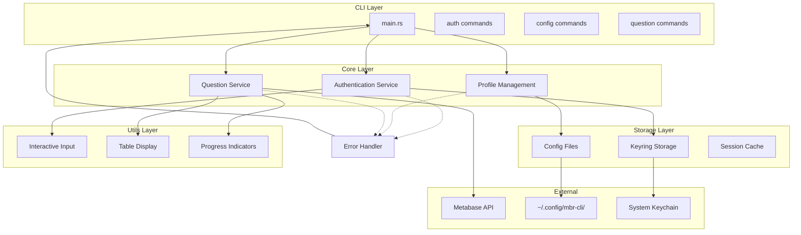
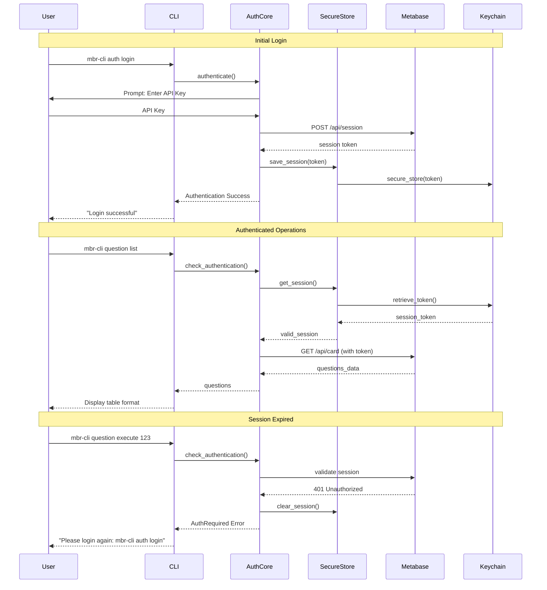
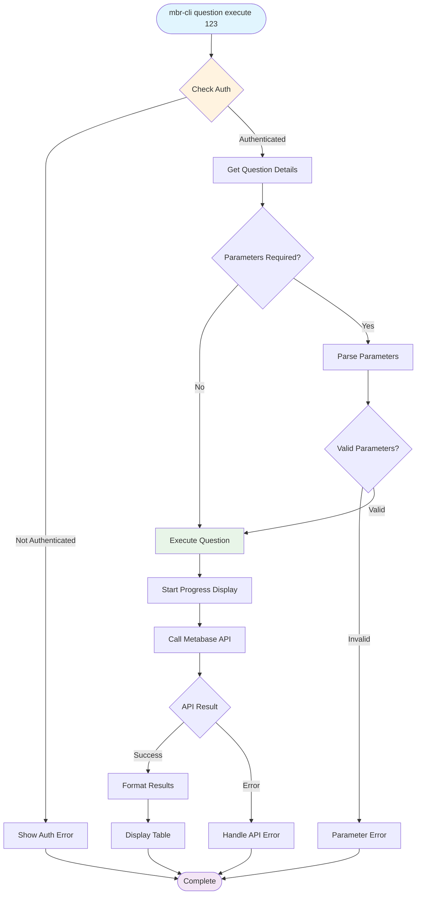
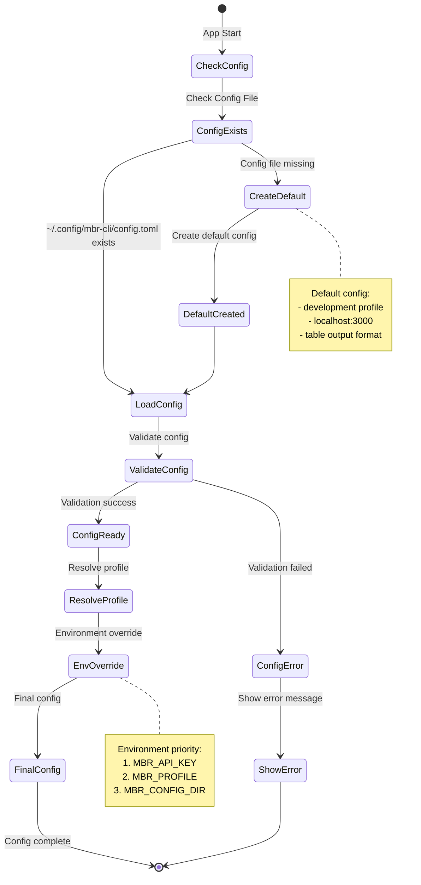
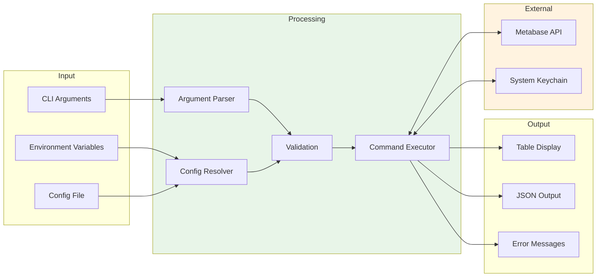

# MBR-CLI Architecture Design

## System Architecture Overview

## Authentication Flow

## Question Execution Flow

## Configuration Management Flow

## Error Handling Hierarchy

```mermaid
graph TD
    AppError[AppError<br/>Top Level Error] --> CliError[CliError<br/>CLI Operation Error]
    AppError --> ApiError[ApiError<br/>API Communication Error]
    AppError --> ConfigError[ConfigError<br/>Configuration Error]
    AppError --> AuthError[AuthError<br/>Authentication Error]
    AppError --> StorageError[StorageError<br/>Storage Error]
    AppError --> QuestionError[QuestionError<br/>Question Operation Error]
    
    CliError --> AuthRequired[Authentication Required]
    CliError --> InvalidArgs[Invalid Arguments]
    
    ApiError --> Timeout[Timeout]
    ApiError --> Http[HTTP Error]
    ApiError --> Unauthorized[Authentication Failed]
    ApiError --> RateLimit[Rate Limited]
    
    ConfigError --> FileNotFound[Config File Not Found]
    ConfigError --> InvalidFormat[Invalid Format]
    ConfigError --> MissingField[Missing Required Field]
    
    AuthError --> InvalidCredentials[Invalid Credentials]
    AuthError --> SessionExpired[Session Expired]
    
    StorageError --> KeyringError[Keychain Error]
    StorageError --> FilePermission[File Permission Error]
    
    style AppError fill:#ffcdd2
    style CliError fill:#fff3e0
    style ApiError fill:#e8f5e8
    style ConfigError fill:#e1f5fe
    style AuthError fill:#fce4ec
    style StorageError fill:#f3e5f5
```

## Data Flow Overview

## Architecture Principles

### Layer Dependencies
- **CLI Layer**: User interface, argument parsing
- **Core Layer**: Business logic, domain services
- **Storage Layer**: Data persistence, secure storage
- **Utils Layer**: Common utilities, display functions

### Error-First Design
1. **Failure Pattern First**: Design all possible failure cases upfront
2. **Hierarchical Error Handling**: Domain-specific errors → unified errors
3. **Usability Focus**: Practical error messages and recovery procedures

### Async-First Architecture
- **tokio runtime**: All I/O operations handled asynchronously
- **reqwest**: Async HTTP communication execution
- **async/await**: Explicit async boundary management

## Current Implementation Status

### Implemented Components ✅
- **Error System** (src/error.rs): Full hierarchy with AppError, CliError, ApiError, ConfigError, AuthError, StorageError
- **CLI Layer**:
  - main_types.rs: Command structure with clap derive macros
  - dispatcher.rs: Command routing with auth login/logout, config show
- **Storage Layer**:
  - config.rs: TOML configuration with profile management
  - credentials.rs: Keyring integration with session persistence
- **API Layer**:
  - client.rs: MetabaseClient with login/logout/session management
  - models.rs: API data models with custom deserializers

### In Progress 🔄
- **Session Management**: Auto-restoration on startup
- **Question Commands**: List and execute operations

### Not Implemented ⏳
- **Core Layer**: Business logic services
- **Utils Layer**: Display utilities, progress indicators
- **Config Commands**: Set operations
- **Cache System**: Response caching mechanism