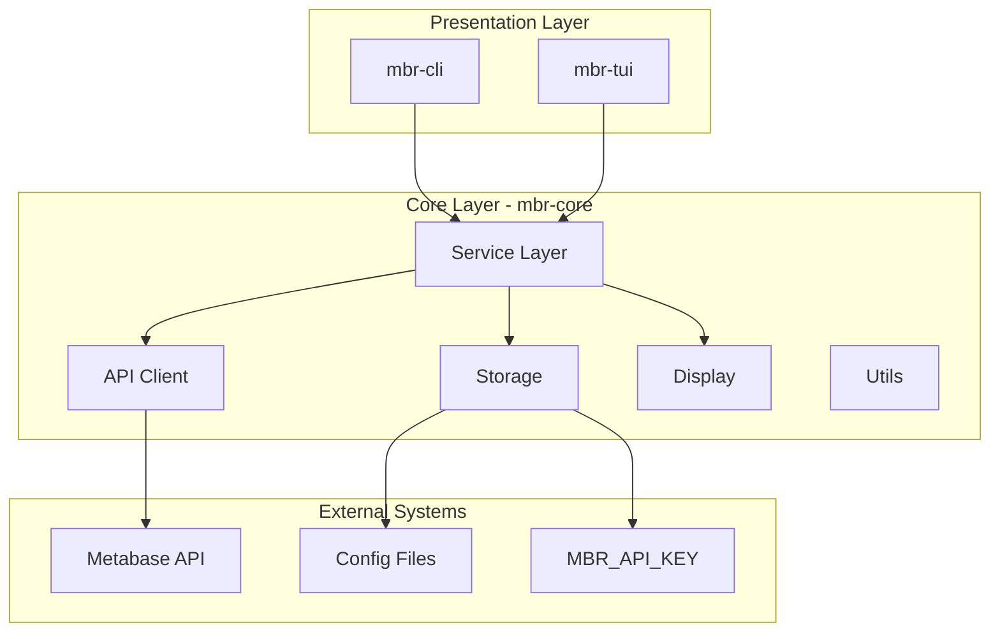
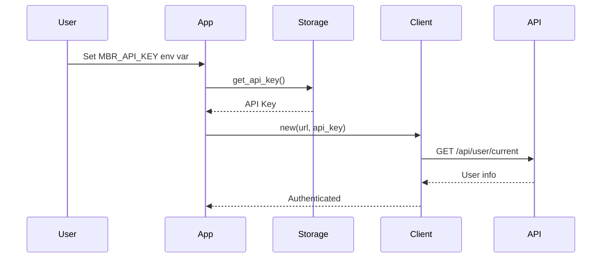
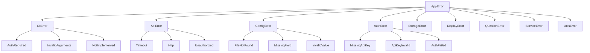
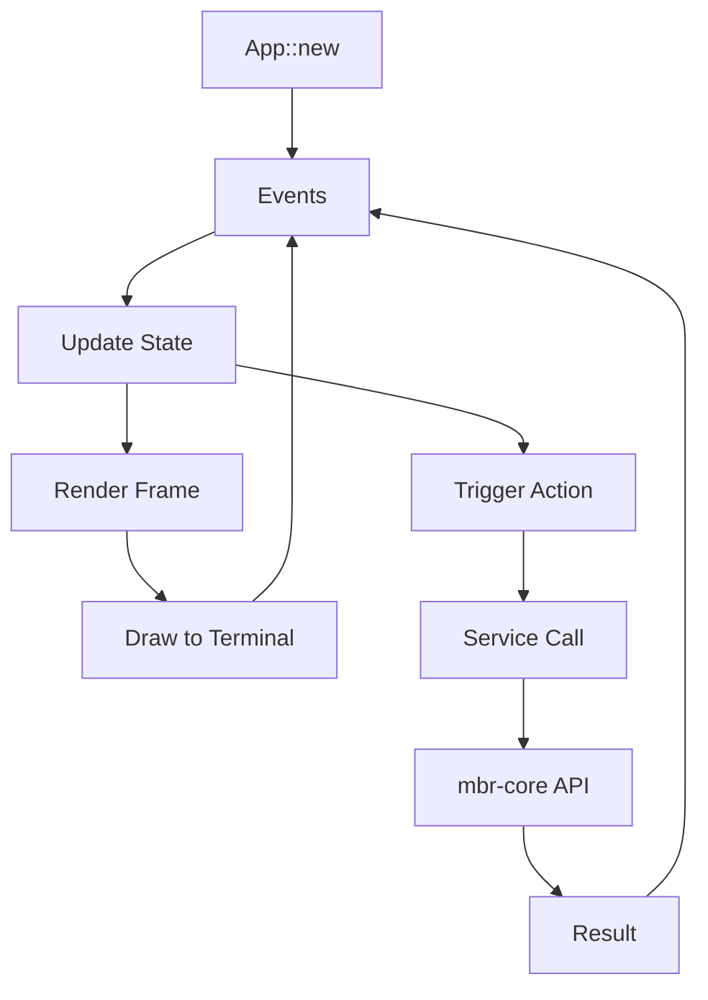
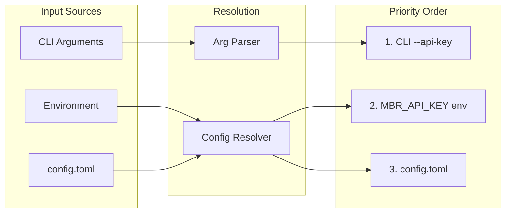
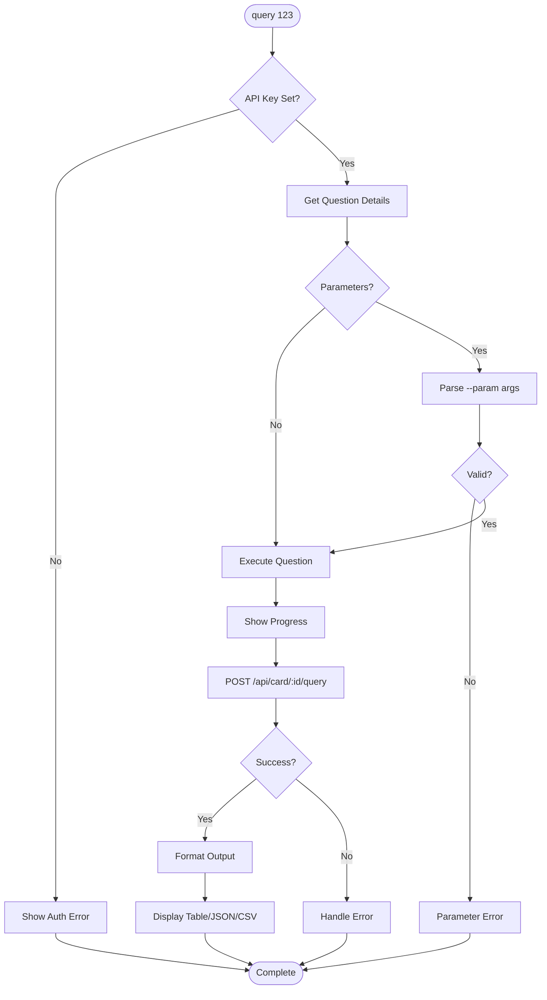

# MBR-CLI Architecture Design

## System Architecture Overview



## Workspace Structure

The project is organized as a Cargo Workspace with three crates:

### 1. mbr-core (Foundation Library)

The shared library containing all business logic, API communication, and data management.

**Modules:**
- `api/` - Metabase HTTP client and data models
- `core/services/` - Business logic services (ConfigService, QuestionService)
- `storage/` - Configuration (TOML) and credential management
- `utils/` - Validation, text formatting, data helpers
- `display/` - Table rendering, pagination, progress indicators
- `error.rs` - Hierarchical error system

### 2. mbr-cli (Command Line Interface)

Thin CLI wrapper using clap for argument parsing.

**Modules:**
- `cli/main_types.rs` - Command definitions with clap derive
- `cli/dispatcher.rs` - Facade delegating to services
- `cli/command_handlers.rs` - Config, Query handlers
- `cli/interactive_display.rs` - Paginated output

### 3. mbr-tui (Terminal User Interface)

Interactive TUI using ratatui framework.

**Modules:**
- `app.rs` - Application state and event loop
- `components/` - UI components (content views, modals, status bar)
- `event.rs` - Keyboard/mouse event handling
- `action.rs` - User action definitions
- `service.rs` - API service integration

## Authentication Flow



**Key Points:**
- Authentication is stateless via `MBR_API_KEY` environment variable
- No session management or token storage
- API key is passed with each request as `x-api-key` header

## Error Handling Hierarchy



**Features:**
- Domain-specific error variants with context fields
- Severity levels (Critical, High, Medium, Low)
- Troubleshooting hints for common errors
- Automatic conversion via `thiserror` derive

## TUI Architecture

The TUI follows a unidirectional data flow pattern:



**Components:**
- `App` - Centralized state with `should_quit`, `active_tab`, `data`
- `ContentPanel` - Main content area with tabs
- `StatusBar` - Connection status and keybindings
- `HelpOverlay` - Modal help display
- `RecordDetailOverlay` - Record inspection view

## Configuration Management



**Configuration File:** `~/.config/mbr-cli/config.toml`

```toml
[profiles.default]
url = "https://metabase.example.com"

[profiles.production]
url = "https://metabase.prod.example.com"
```

## Query Execution Flow



## Architecture Principles

### Layer Dependencies

Each layer only depends on layers below it:

```
CLI/TUI --> Core --> Storage --> Utils
                       |
                       v
                      API
```

### Design Patterns

- **Facade Pattern**: CLI dispatcher delegates to services
- **Service Layer**: Business logic separated from presentation
- **Component-Based UI**: TUI uses reusable components
- **Error-First Design**: Comprehensive error handling with hints

### Key Dependencies

| Crate | Purpose |
|-------|---------|
| clap 4.5 | CLI argument parsing |
| tokio 1.40 | Async runtime |
| reqwest 0.11 | HTTP client |
| ratatui 0.29 | Terminal UI framework |
| thiserror 1.0 | Error type derivation |
| serde 1.0 | Serialization |
