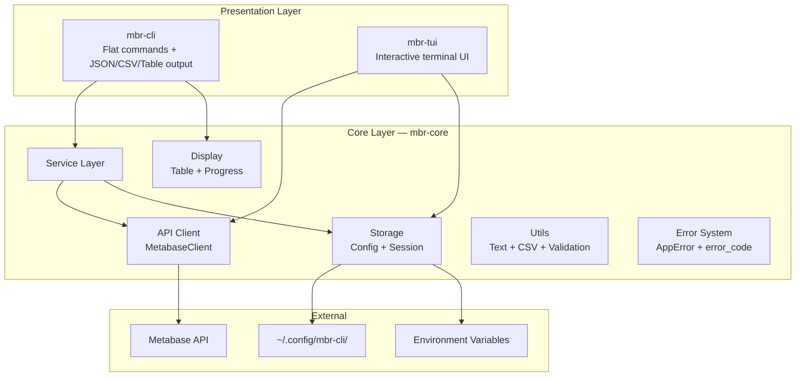
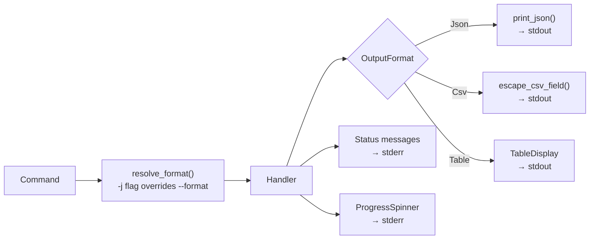
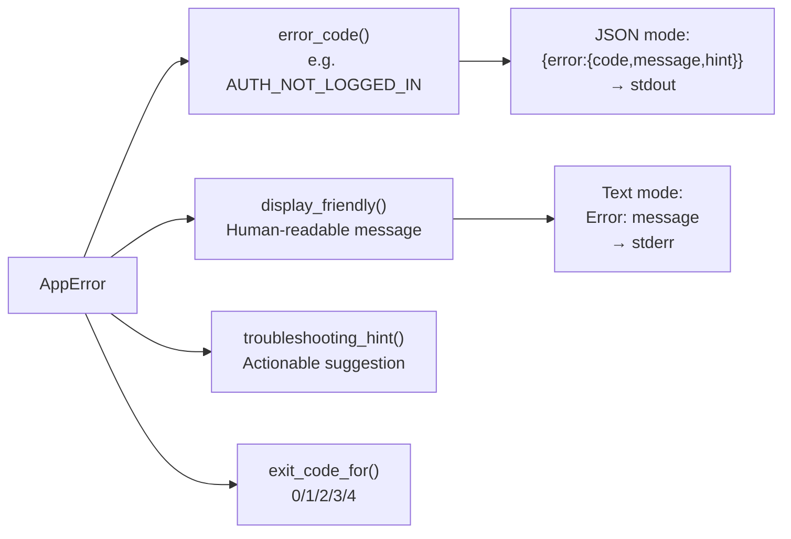
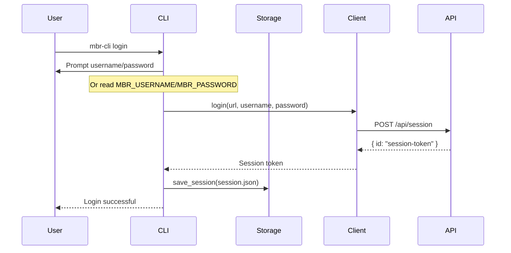
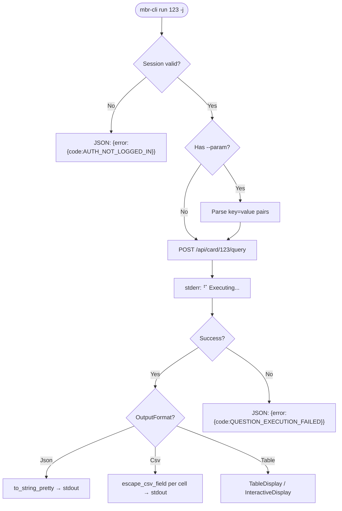
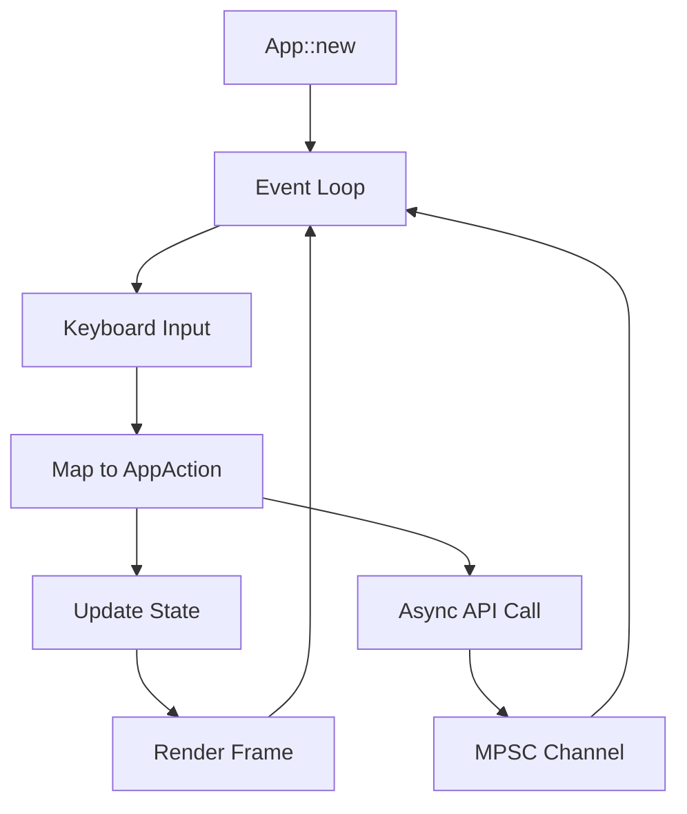

# MBR-CLI Architecture

## System Overview


```mermaid
graph TB
    subgraph Presentation["Presentation Layer"]
        CLI[mbr-cli<br/>Flat commands + JSON/CSV/Table output]
        TUI[mbr-tui<br/>Interactive terminal UI]
    end

    subgraph Core["Core Layer — mbr-core"]
        Services[Service Layer]
        API[API Client<br/>MetabaseClient]
        Storage[Storage<br/>Config + Session]
        Display[Display<br/>Table + Progress]
        Utils[Utils<br/>Text + CSV + Validation]
        Error[Error System<br/>AppError + error_code]
    end

    subgraph External["External"]
        Metabase[Metabase API]
        FS[~/.config/mbr-cli/]
        Env[Environment Variables]
    end

    CLI --> Services
    CLI --> Display
    TUI --> API
    TUI --> Storage

    Services --> API
    Services --> Storage

    API --> Metabase
    Storage --> FS
    Storage --> Env
```

## Workspace Structure

```
crates/
├── mbr-cli/          # CLI binary
│   └── src/cli/
│       ├── main_types.rs        # Flat command definitions (clap derive)
│       ├── dispatcher.rs        # Command routing + auth
│       ├── command_handlers.rs  # Handler functions per command
│       ├── output.rs            # OutputFormat, JSON helpers, error output
│       └── interactive_display.rs  # Fullscreen pagination
├── mbr-core/         # Shared library
│   └── src/
│       ├── api/          # MetabaseClient + API models
│       ├── core/         # Services (Config, Question), Cache
│       ├── storage/      # Config (TOML) + Credentials (session.json)
│       ├── display/      # TableDisplay, ProgressSpinner, Pagination, DisplayOptions
│       ├── utils/        # text (CSV escape), validation, logging, data, memory, retry
│       └── error.rs      # Hierarchical error system
└── mbr-tui/          # TUI binary
    └── src/
        ├── app/          # App state, action/data/input handlers
        ├── components/   # UI components (content, modals, clipboard, styles)
        ├── service.rs    # ServiceClient, LoadState<T>, AppData
        ├── event.rs      # Event handling
        └── layout.rs     # Layout definitions
```

### Crate Dependencies

```
mbr-cli  ──┐
           ├──► mbr-core
mbr-tui  ──┘
```

## CLI Command Architecture

### Flat Command Structure

Commands are defined as a flat enum in `main_types.rs`:

```
mbr-cli
├── queries       # List saved questions
├── run <ID>      # Execute a question
├── collections   # List collections
├── databases     # List databases
├── tables <DB> <SCHEMA>  # List tables
├── status        # Connection status
├── login         # Authenticate
├── logout        # Clear session
└── config
    ├── set-url <URL>   # Set server URL
    └── validate        # Validate session
```

### Output Pipeline


```mermaid
flowchart LR
    Command --> Resolve["resolve_format()<br/>-j flag overrides --format"]
    Resolve --> Handler
    Handler --> Format{OutputFormat}
    Format -->|Json| JSON["print_json()<br/>→ stdout"]
    Format -->|Csv| CSV["escape_csv_field()<br/>→ stdout"]
    Format -->|Table| Table["TableDisplay<br/>→ stdout"]

    Handler --> Status["Status messages<br/>→ stderr"]
    Handler --> Spinner["ProgressSpinner<br/>→ stderr"]
```

**Key design decisions:**
- Data output goes to stdout, status/progress goes to stderr (pipeline safe)
- Global `-j` flag overrides per-command `--format` via `resolve_format()`
- `print_json()` uses `serde_json::to_string_pretty` for readable output
- CSV fields escaped per RFC 4180 via shared `escape_csv_field()` in mbr-core

### Error Handling


```mermaid
flowchart LR
    Error[AppError] --> Code["error_code()<br/>e.g. AUTH_NOT_LOGGED_IN"]
    Error --> Friendly["display_friendly()<br/>Human-readable message"]
    Error --> Hint["troubleshooting_hint()<br/>Actionable suggestion"]
    Error --> Exit["exit_code_for()<br/>0/1/2/3/4"]

    Code --> JSON_Err["JSON mode:<br/>{error:{code,message,hint}}<br/>→ stdout"]
    Friendly --> Text_Err["Text mode:<br/>Error: message<br/>→ stderr"]
```

**Exit codes:**

| Code | Meaning |
|------|---------|
| 0 | Success |
| 1 | CLI error (invalid args), Display, Service, or Utils error |
| 2 | API error (HTTP, query failure) or Question error |
| 3 | Auth error (not logged in, expired) |
| 4 | Config error (file, validation) or Storage error |

**Error code examples:** `AUTH_NOT_LOGGED_IN`, `API_UNAUTHORIZED`, `API_TIMEOUT`, `QUESTION_NOT_FOUND`, `CONFIG_MISSING_FIELD`

## Authentication Flow


```mermaid
sequenceDiagram
    participant User
    participant CLI
    participant Storage
    participant Client
    participant API

    User->>CLI: mbr-cli login
    CLI->>User: Prompt username/password
    Note over CLI: Or read MBR_USERNAME/MBR_PASSWORD
    CLI->>Client: login(url, username, password)
    Client->>API: POST /api/session
    API-->>Client: { id: "session-token" }
    Client-->>CLI: Session token
    CLI->>Storage: save_session(session.json)
    CLI-->>User: Login successful
```

**Auto re-login:** On 401 Unauthorized, the dispatcher automatically attempts re-login if `MBR_USERNAME`/`MBR_PASSWORD` are set.

**Session storage:** `~/.config/mbr-cli/session.json` (mode 0600 on Unix)

## Query Execution Flow


```mermaid
flowchart TD
    Start([mbr-cli run 123 -j]) --> Auth{Session valid?}
    Auth -->|No| AuthErr["JSON: {error:{code:AUTH_NOT_LOGGED_IN}}"]
    Auth -->|Yes| Params{Has --param?}

    Params -->|Yes| Parse[Parse key=value pairs]
    Params -->|No| Exec[POST /api/card/123/query]
    Parse --> Exec

    Exec --> Spinner["stderr: ⠋ Executing..."]
    Spinner --> Result{Success?}

    Result -->|Yes| Format{OutputFormat?}
    Result -->|No| Err["JSON: {error:{code:QUESTION_EXECUTION_FAILED}}"]

    Format -->|Json| Stream["to_string_pretty → stdout"]
    Format -->|Csv| CSV["escape_csv_field per cell → stdout"]
    Format -->|Table| Interactive["TableDisplay / InteractiveDisplay"]
```

## TUI Architecture

Event-driven unidirectional data flow:


```mermaid
flowchart TD
    Init[App::new] --> Loop
    Loop[Event Loop] --> Input[Keyboard Input]
    Input --> Action[Map to AppAction]
    Action --> Update[Update State]
    Update --> Render[Render Frame]
    Render --> Loop

    Action --> Async[Async API Call]
    Async --> Channel[MPSC Channel]
    Channel --> Loop
```

**Components:**
- `App` — Centralized state, event loop, action dispatch
- `ContentPanel` — Tabbed content (Questions / Collections / Databases)
- `StatusBar` — Connection info and key hints
- `HelpOverlay` — Modal help display
- `RecordDetailOverlay` — Record inspection
- `CopyMenu` — Clipboard format selection (JSON/CSV/TSV)

**State pattern:** `LoadState<T>` enum (Idle / Loading / Loaded / Error)

## Configuration

**Config file:** `~/.config/mbr-cli/config.toml`
```toml
url = "https://metabase.example.com"
```

**URL priority:** `MBR_URL` env var > `config.toml`

**Session file:** `~/.config/mbr-cli/session.json`
```json
{
  "session_token": "...",
  "url": "https://metabase.example.com",
  "username": "user@example.com",
  "created_at": "2026-03-30T12:00:00Z"
}
```

## Key Dependencies

| Crate | Purpose |
|-------|---------|
| clap 4.5 | CLI argument parsing (derive macros) |
| tokio 1.40 | Async runtime |
| reqwest 0.11 | HTTP client |
| ratatui 0.29 | Terminal UI framework |
| thiserror 1.0 | Error type derivation |
| serde 1.0 | Serialization/deserialization |
| serde_json 1.0 | JSON output |
| comfy-table 7.1 | Table rendering |
| crossterm 0.29 | Terminal control |

## Design Principles

- **Layer isolation**: CLI/TUI depend on Core; Core depends on Storage/API. No upward dependencies.
- **Shared core**: All business logic lives in mbr-core; presentation stays in CLI/TUI.
- **Pipeline safety**: Data output goes to stdout, status/progress goes to stderr.
- **Error-first**: Every operation returns `Result<T, AppError>` with structured error codes.
- **Flat commands**: Top-level subcommands with aliases (`q`, `c`, `db`, `cfg`) for quick access.
